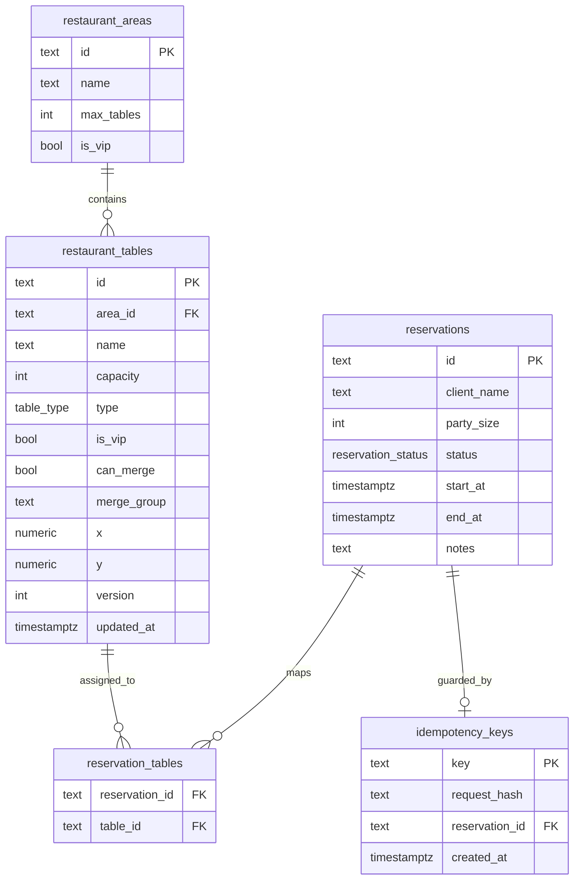

# ERD

## Entidades y relaciones

## Índices recomendados
- `restaurant_tables(area_id)`
- `reservations(start_at, end_at)`
- `reservations(status)`
- `reservation_tables(table_id)`
- `idempotency_keys(created_at)`

## Reglas clave
- `party_size >= 1`.
- `start_at < end_at`.
- No overlap para mesas compartidas en reservas activas.
- VIP A+B (merge_group `VIP_AB`) máximo 6 personas.
- Máximo 2 unidades funcionales VIP simultáneas.
- Posición `x,y` con clamp por área y tamaño de mesa.
