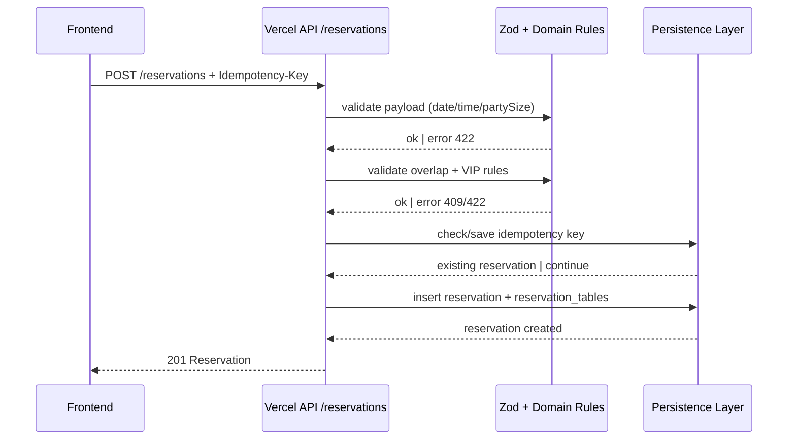
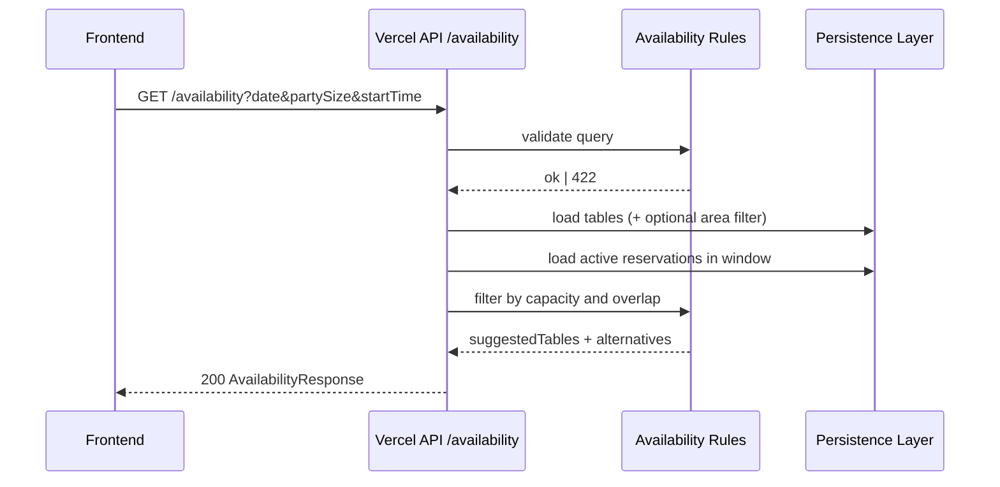

# SEQUENCE

## POST /reservations

```mermaid
sequenceDiagram
  participant UI as Frontend
  participant API as Vercel API /reservations
  participant VAL as Zod + Domain Rules
  participant DB as Persistence Layer

  UI->>API: POST /reservations + Idempotency-Key
  API->>VAL: validate payload (date/time/partySize)
  VAL-->>API: ok | error 422
  API->>VAL: validate overlap + VIP rules
  VAL-->>API: ok | error 409/422
  API->>DB: check/save idempotency key
  DB-->>API: existing reservation | continue
  API->>DB: insert reservation + reservation_tables
  DB-->>API: reservation created
  API-->>UI: 201 Reservation
```

## GET /availability

```mermaid
sequenceDiagram
  participant UI as Frontend
  participant API as Vercel API /availability
  participant RULES as Availability Rules
  participant DB as Persistence Layer

  UI->>API: GET /availability?date&partySize&startTime
  API->>RULES: validate query
  RULES-->>API: ok | 422
  API->>DB: load tables (+ optional area filter)
  API->>DB: load active reservations in window
  API->>RULES: filter by capacity and overlap
  RULES-->>API: suggestedTables + alternatives
  API-->>UI: 200 AvailabilityResponse
```
